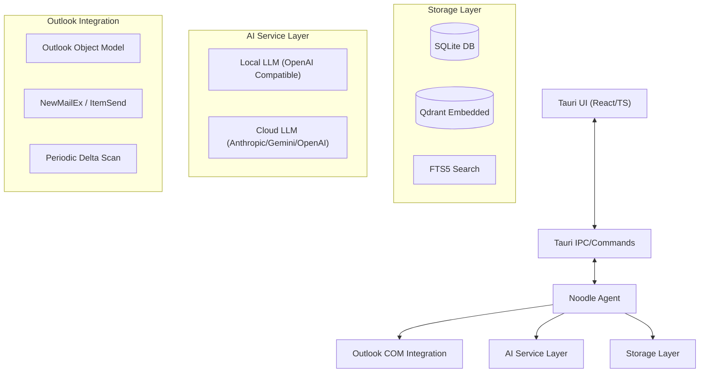

# Architecture Overview - Noodle (Outlook AI Agent)

Noodle is a production-grade Windows desktop application built in Rust, leveraging Tauri v2 for the UI shell and React for the frontend. It provides deep integration with Microsoft Outlook to index, analyze, and enrich emails using local or cloud-based LLMs.

## Component Diagram

## Key Modules

| Module | Responsibility |
| :--- | :--- |
| `core` | Shared data models, error types, and validation schemas. |
| `storage` | SQLite migrations, SQLx repository, and Qdrant Embedded wrapper. |
| `outlook` | Windows COM automation for reading and monitoring Outlook emails. |
| `ai` | Provider abstraction and implementations (OpenAI, Anthropic, Gemini, Local). |
| `agent` | Background indexing pipeline, prompt engine, and periodic runners. |
| `ui` | Tauri backend shell and React/TypeScript frontend. |

## Data Flow
1. **Ingestion**: `outlook` module detects new mail via COM events or delta scan.
2. **Analysis**: `agent` pipeline extracts text, generates embeddings via `ai`, and runs extraction prompts.
3. **Persistence**: Structured data and AI facts are stored in `SQLite`; embeddings and metadata are upserted to `Qdrant`.
4. **Graph/Search**: Entities and relationships are extracted to build a local knowledge graph; `FTS5` and vector search power the UI.
5. **UI Interaction**: User searches or manages prompts via the `ui` module, which fetches data from the storage layer.

## Security & Privacy
- **Local First**: All data and embeddings remain on the device by default.
- **Credential Management**: API keys are stored securely in Windows Credential Manager.
- **Privacy Controls**: Exclusions based on domain, subject keywords, and email addresses are enforced at the ingestion level.
